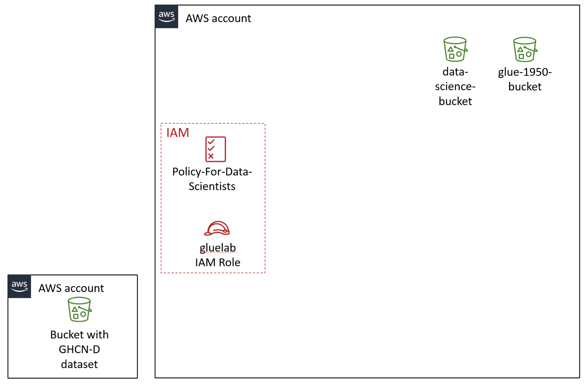

**Performing ETL on a Dataset by Using AWS Glue**
**Lab overview and objectives**

Big data problems often involve a large number of heterogeneous data sources. As a data analyst, you might not know the schema for some data sources. This is the variety aspect of the five Vs of big data (volume, variety, velocity, veracity, and value). In this lab, you will work with AWS Glue to perform extract, transform, and load (ETL) for a dataset. You can direct AWS Glue to a data source, and it can infer a schema based on the data types that it discovers. Then, AWS Glue builds a Data Catalog that contains metadata about the various data sources.

AWS Glue is similar to Amazon Athena in that the actual data that you analyze remains in the data source. The key difference is that you can build a crawler with AWS Glue to discover the schema and then extract the data from the dataset. You can also transform the schema and then load the data into an AWS Glue database. You can then analyze the data by using SQL statements in Athena.

In this lab, you will learn how to use AWS Glue to import a dataset from Amazon Simple Storage Service (Amazon S3). You will then extract the data, transform its schema, and load the dataset into an AWS Glue database for later analysis by using Athena.

**Scenario**
The data science team has asked you to create a series of proofs of concept (POCs) to use AWS services to address many of the data engineering and data analysis needs of the university. Mary, one of the data science team members, has seen what Athena can do to create tables that have defined schemas and is impressed. She asks you if it's possible to infer the columns and data types automatically. Defining the schema takes much of her time when she deals with large amounts of varied data. You want to develop a POC to use AWS Glue, which is designed for use cases that are similar to this one.

To develop a POC, Mary suggests that you use a publicly available dataset, the Global Historical Climatology Network Daily [GHCN-D] dataset, contains daily weather summaries from ground-based stations, going back to 1763.  The dataset is publicly available in an S3 bucket. 

Mary explains that the most common recorded parameters in the dataset are daily temperatures, rainfall, and snowfall. These parameters are useful to assess risks for drought, flooding, and extreme weather. The data definitions used in this lab are available on the NOAA Global Historical Climatology Network Daily (GHCN-D) Dataset page.  

Note: As of October 2022, the dataset has been split into sub-datasets, by_year and by_station.  Throughout this lab you will be using by_year and it can be found at s3://noaa-ghcn-pds/csv/by_year/.

When you start the lab, the environment will contain the resources that are shown in the following diagram. For this lab environment, the original data source is an S3 bucket that exists in another AWS account.

